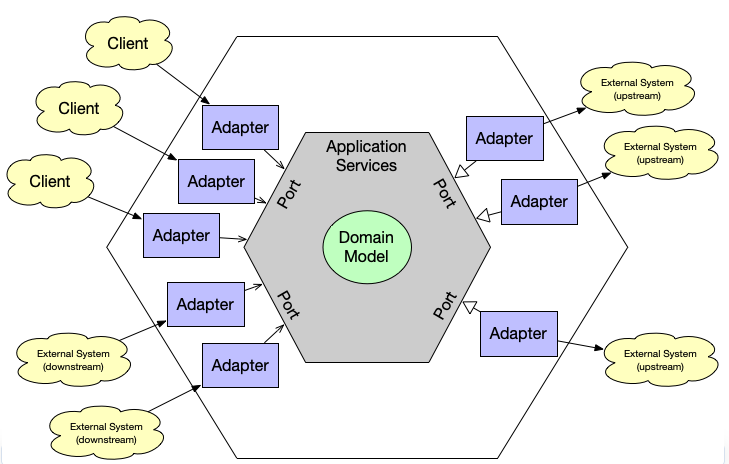

# Arquitetura hexagonal

#### Motivação para estudo
Muitos desenvolvedores estão deixando de estudar arquiteturas de software, focando mais em aprender tecnologias do momento.

Acabamos desenvolvendo sistemas de acordo com os padrões sugeridos por frameworks, o que futuramente torna quase impossível alterar a tecnologia dos serviços desenvolvidos.

Devemos pensar em desenvolver sistemas de modo que seu crescimento seja sustentável.

A complexidade inicial acaba se pagando ao longo do projeto.

#### Conceito inicial
Foi propost por Alistair Cockburn em meados dos anos 90. 
Seu principal objetivo é isolar as classes de domínio, tornando ela independente de infraestrutura, tecnologia ou sistemas internos.

Ela também é conhecida como "Ports and Adapters". 
Um ponto interessante é que o hexágono representa a delimitação entre as camadas, não necessariamente que o sistema deve ter 6 tipos de portas.

#### Pontos importantes
 - Portas
   - Portas de entrada 
   - Portas de saída
   
 - Adaptadores
 - DDD
 - SOLID
   - S -> Single Responsability Principle
   - I -> Interface Segregation
   - D -> Dependency inversion

